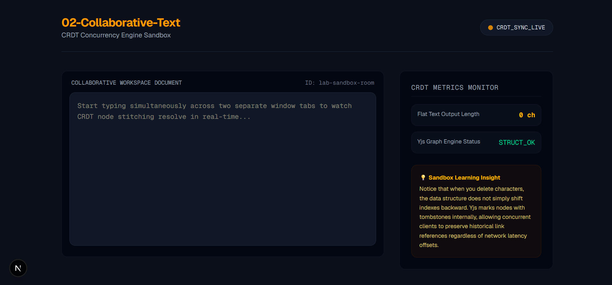

# Module 02: Collaborative Text (CRDT Concurrency Sync Engine)

This lab module drops deep into the mechanics of **Conflict-free Replicated Data Types (CRDTs)** and distributed multi-user synchronization. By decoupling network operations from rich code components, this module builds a lightweight, transparent text-weaver system demonstrating how structural text states sync gracefully across isolated browser windows without a central authoritative lock.



---

## 📚 Architectural Theory Focus

### 1. The Collaborative Collision Problem

When building standard web services, text values are treated as absolute payloads. If User A modifications arrive at index position $3$ (`Insert 's'`), and User B concurrent modifications arrive at index position $1$ (`Insert 'h'`), a standard string overwrite creates severe race conditions:

- **The Winner-Takes-All Bug:** The packet that reaches the backend loop last completely obliterates the structural mutations of the faster packet.
- **The Index Offset De-sync:** Shifting base document indexes causes the second user's inputs to jump violently, throwing carets into corrupted layout offsets.

### 2. The CRDT Paradigm vs. Operational Transformation (OT)

Instead of relying on rigid, centralized structural recalculations (like Google Docs OT systems), modern distributed architectures leverage **CRDTs (Conflict-free Replicated Data Types)**:

- **Independent Computation:** Edits are calculated as commutative mathematical properties. Operations can arrive out of order, across varying latency delays, yet every node automatically resolves to an identical textual structure.
- **The Linked List Node Map:** Characters are decoupled from standard index slots ($0, 1, 2\dots$) and wrapped as atomic metadata nodes. Each node registers its own distinct identifier (`[User_ID, Global_Clock]`) and embeds hard references to its immediate left and right character neighbors.

---

## 🫀 Operational Lifecycle Mapping

Data changes pass down the socket highway using compact binary delta arrays (`Uint8Array`) to minimize footprint and round-trip overhead.

```text
[ Next.js Client A ] ----(sync-update: Keystroke Delta)----> [ Express Backend Relay ]
					  |
					  | (applyUpdate to headless Y.Doc)
					  v
				  [ Headless Y.Doc ]
					  |
					  | (encoded update buffer)
					  v
[ Next.js Client B ] <---(sync-update: Binary Payload)-----------------+
```

### The Synchronization Phase Matrix

1. **The Handshake Handover:** When a client joins a workspace channel, the server ensures an in-memory headless `Y.Doc` exists for that channel.
2. **State Vector Assessment (`sync-step-1`):** The server and client exchange state vectors to determine which updates each side is missing.
3. **The Delta Reconciliation:** The missing updates are encoded into a compact binary buffer and sent over the socket; clients call `Y.applyUpdate()` to merge the changes idempotently.

---

## 🛠️ File Layout

The repository layout for this module (top-level):

```text
02-collaborative-text/
├── backend/
│   ├── server.js         # Node server hosting headless Yjs states
│   └── package.json
├── frontend/
│   ├── app/
│   │   └── page.js       # Editor viewport & Yjs telemetry
│   ├── public/           # Static assets served by Next.js
│   └── package.json
└── README.md
```

---

## 🚀 Execution & Verification Sandbox

### 1. Booting the Concurrency Core

Navigate into the backend environment, install dependencies, and start the system synchronization loop:

```bash
cd backend
npm install
node server.js
```

The server binds to local port 4000, logging document allocation scopes and raw network state handshakes.

### 2. Launching the Multi-Peer Layout

In a secondary terminal tab, compile the client Next.js environment:

```bash
cd ../frontend
npm install
npm run dev
```

The development environment boots on http://localhost:3000.

### 3. Verification Protocol

Launch two separate web browser sessions side-by-side pointing to http://localhost:3000.

- Type a sentence into Window 1. Observe the flat text length updates and note how the internal graph framework mirrors characters into Window 2 instantaneously.
- Place focus on both editor textareas simultaneously and type rapidly at the exact same moment.
- Observe how the characters intertwine and stitch neatly together without crashing, dropping characters, or scrambling caret focus targets.

🧠 Key Takeaways for Future Systems

- Tombstone Architecture: When text is deleted inside a Yjs structure, nodes are not removed from the history graph; they are marked with a logical tombstone. This allows late-arriving packets to trace old positional references reliably.

- Idempotency Guarantee: Because the operational engine functions idempotently, the exact same update package can be applied multiple times or in out-of-order networks without mutating the final text resolution state.
